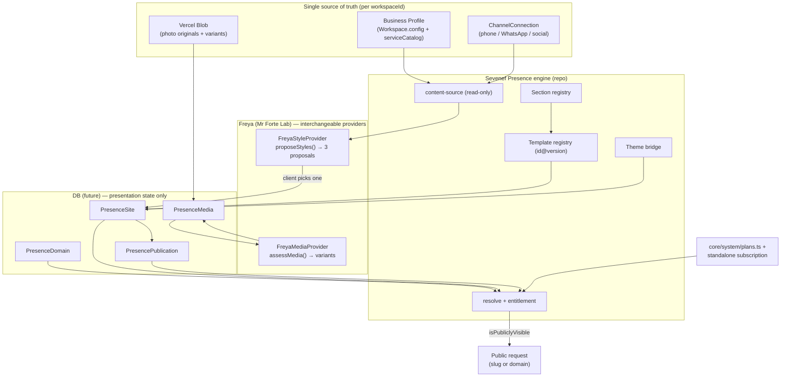

# Sevenef Presence & Freya Site Engine — architecture (PRESENCE-01)

> **Foundation deliverable.** This document is the audit + architecture for the
> shared website engine. The code shipped with it (`engines/presence/*`,
> `agents/freya/manifest.ts`) is a **contract + registry + pure-logic** layer.
> No Prisma model, public route, UI, or AI integration is wired yet — on
> purpose (see `docs/ways-of-working.md`: foundation is clearly labeled).

## 1. What Sevenef Presence is

The shared engine to create and publish business websites. It is **not** a
Finesse feature. It can be:

1. included inside 7F SaaS plans and their verticals;
2. sold standalone to businesses that don't use 7F SaaS;
3. produced from Mr Forte Lab.

**Finesse** is only the Beauty vertical of 7F SaaS. **Freya** is the transversal
creative agent (Mr Forte Lab) whose capabilities Presence consumes (style
proposals, photo assessment) and which are also used by Finesse, Growth,
Magazine and future verticals.

The client does **not** write prompts or edit the page. Public content comes
from the **Business Profile**. Freya prepares three styles; the client picks
one; the site publishes. Later changes are made by updating the Business
Profile, not by editing the site.

## 2. Audit of the current repo (before modifying)

| Concern | What exists today | Location |
|---|---|---|
| Workspace / multi-tenancy | `Workspace` model with `slug @unique`, `verticalKey`, `config` (JSON), `plan`, `status`; `workspaceId` is the tenant key everywhere. | `prisma/schema.prisma:25`, `core/workspace.ts` |
| Business Profile | **No table.** JSON in `Workspace.config.businessProfile` (8 flat fields) + `serviceCatalog` (name/category/active, **no price**). | `core/verticals.ts`, `app/api/workspace/business-profile/route.ts` |
| Phone / WhatsApp / social | `ChannelConnection` (channelType, provider, config, encrypted credentials). | `prisma/schema.prisma:1071` |
| Media / photos | Per-record models only (`MessageAttachment`, `ClientAsset`, `Attachment`, `ContentPiece.mediaUrl`). **No workspace-level photo library.** | `prisma/schema.prisma` |
| File storage | Vercel Blob (`uploadToStorage`/`deleteFromStorage`), env `BLOB_READ_WRITE_TOKEN`. Files never in git. | `core/storage.ts` |
| Domains / slugs | `Workspace.slug @unique` only. Middleware routing is **cookie-based**; no host/domain or public slug resolution. | `middleware.ts` |
| Plans / entitlements | `core/system/plans.ts` (`TenantPlan`, `PLAN_DEFINITIONS`, `resolveWorkspacePlan`, `enabledModules`). **Observational, no gating, no billing.** | `core/system/plans.ts` |
| Themes / tokens | Theme keys → CSS token blocks `[data-theme]`; no hex in code. | `core/theme.ts`, `app/globals.css` |
| Registry pattern | Singleton `registry` with Module/Engine/Tool/Agent manifests; `AgentRole` already reserves `"generative"` for Freya. | `core/registry/*` |
| Freya | Roster metadata only (`active:false`), i18n strings, one static UI card. **No engine, runtime, or generation logic.** | `modules/agents/roster.ts` |
| AI providers | `engines/ai` thin `fetch` facade (OpenAI/DeepSeek by mode). No mandatory SDK, no `sharp`. `EngineProvider`/`extensionPoints` fields exist but unused. | `engines/ai/*` |
| Prior page/site builders | **None.** Website/landing/microsite generation is `concept`/absent in the design docs. | — |

**Conclusion:** Presence is greenfield. The one hard rule the audit imposes:
**do not duplicate** the Business Profile — read from it.

## 3. Architecture decisions (minimal)

### Where each thing lives

- **Repository (code):** the engine, contracts, section/template registries,
  theme bridge, Freya provider interfaces + default heuristic providers.
  → `engines/presence/`, `agents/freya/`.
- **Database (future):** presentation state and publication facts, keyed by
  `workspaceId`. **No public business data** is stored here. Intended models:
  - `PresenceSite` — slug, status, ownership model, template id+version, theme,
    selected proposal, section instances.
  - `PresencePublication` — immutable publish/offline transitions (frozen
    template+theme for reproducibility).
  - `PresenceDomain` — hostname, kind (subdomain/custom), verification,
    ownership (client_owned/managed/transferable).
  - `PresenceMedia` — external `storageKey`/`url`, kind, role,
    `isRealWorkSample`, variant lineage.
  - `FreyaSiteProposal` / `FreyaMediaAssessment` — Freya outputs pending client
    choice / review.
  These map 1:1 to the TypeScript contracts in `engines/presence/types.ts` and
  `freya.ts`. A later PR adds the Prisma models + a migration.
- **File storage:** photo originals **and** generated variants in Vercel Blob,
  referenced by URL. Never in git.

### Resolution (by slug or domain)

Pure logic in `resolve.ts`:
- `resolveSiteBySlug(slug, sites)` → default subdomain (`<slug>.sevenef.site`).
- `resolveSiteByHostname(hostname, domains, sites)` → custom/verified domain.
A public serving route (future) resolves `workspaceId` from the matched site,
then renders read-only content from the Business Profile.

### Publication on/off & Presence continuity

`isPresencePubliclyVisible(site, publication, entitlement)` requires
`status === "published"`, latest publication `public`, **and** entitlement.
`resolvePresenceEntitlement({ plan, standalone })`:
- entitled via **plan** when Presence is in `enabledModules` (or `all`);
- else entitled via an **active standalone** subscription.

This is exactly what lets a site keep running after 7F SaaS is cancelled: the
plan no longer includes Presence, but the standalone subscription does. If
neither holds, the site goes offline (fails safe). The domain follows the
`PresenceDomainOwnership` policy (client-owned or transferable).

### Template versioning

Templates are keyed `id@version`. `PresenceSite`/`PresencePublication` pin the
version, so a published site keeps rendering even after a template is superseded
(`status: "deprecated"` stays resolvable).

### Avoiding Business Profile duplication

`content-source.ts` is a **read-only projection**: sections declare the profile
fields they need (`businessProfileSources`); `buildPresenceContentSource` maps
the profile → renderable content and computes `availableSources`. The site owns
presentation state only.

## 4. Data-flow diagram

## 5. Risks & pending

- **No persistence yet.** The contracts must become Prisma models +
  `workspaceId`-scoped queries in a follow-up PR (with a migration + Turso push).
- **Business Profile is thin.** Prices, structured hours, location, team,
  socials and reviews are not modeled yet. They are **profile** extensions
  (owned there), not Presence data. `content-source.ts` already leaves the slots.
- **Public serving layer is out of scope.** Host/domain routing needs middleware
  + a public render route; custom-domain verification (DNS/TLS) is unbuilt.
- **Standalone subscription + billing** are unmodeled (consistent with
  `core/system/plans.ts`). Entitlement is observational until a billing layer
  and an enforcement gate exist.
- **Freya default is heuristic.** Real, deterministic, honestly labeled — but an
  AI provider (v0 or otherwise) is intentionally **not** integrated here.
- **Media variant generation** needs an image pipeline (no `sharp` today); the
  contract declares the variants, a worker produces them later.

## 6. Validation run

- `npx tsx --test engines/presence/*.test.ts` → **33/33 pass**.
- `tsc`: the new **source** files are type-clean; only the `node:test` import
  note appears on `*.test.ts`, which is the repo's pre-existing pattern (same on
  `core/services/catalog.test.ts`; tests run via `tsx`, not `tsc`).

## 7. Explicitly not done (guardrails)

No free CMS, no drag-and-drop builder, no v0 API integration, no repo/Vercel
project per client, no Beauty-only logic in the shared engine, no photos in git,
no mandatory AI-provider dependency, no changes to internal Finesse pages.
