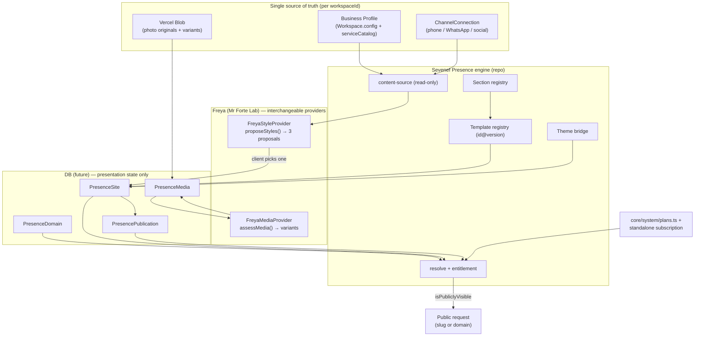

# Sevenef Presence & Freya Site Engine — architecture (PRESENCE-01)

> **Foundation deliverable.** This document is the audit + architecture for the
> shared website engine. The code shipped with it (`engines/presence/*`,
> `agents/freya/manifest.ts`) is a **contract + registry + pure-logic** layer.
> No Prisma model, public route, UI, or AI integration is wired yet — on
> purpose (see `docs/ways-of-working.md`: foundation is clearly labeled).

## 1. What Sevenef Presence is

The shared engine to create and publish business websites. It is **not** a
Finesse feature. It can be:

1. included inside 7F SaaS plans and their verticals;
2. sold standalone to businesses that don't use 7F SaaS;
3. produced from Mr Forte Lab.

**Finesse** is only the Beauty vertical of 7F SaaS. **Freya** is the transversal
creative agent (Mr Forte Lab) whose capabilities Presence consumes (style
proposals, photo assessment) and which are also used by Finesse, Growth,
Magazine and future verticals.

The client does **not** write prompts or edit the page. Public content comes
from the **Business Profile**. Freya prepares three styles; the client picks
one; the site publishes. Later changes are made by updating the Business
Profile, not by editing the site.

## 2. Audit of the current repo (before modifying)

| Concern | What exists today | Location |
|---|---|---|
| Workspace / multi-tenancy | `Workspace` model with `slug @unique`, `verticalKey`, `config` (JSON), `plan`, `status`; `workspaceId` is the tenant key everywhere. | `prisma/schema.prisma:25`, `core/workspace.ts` |
| Business Profile | **No table.** JSON in `Workspace.config.businessProfile` (8 flat fields) + `serviceCatalog` (name/category/active, **no price**). | `core/verticals.ts`, `app/api/workspace/business-profile/route.ts` |
| Phone / WhatsApp / social | `ChannelConnection` (channelType, provider, config, encrypted credentials). | `prisma/schema.prisma:1071` |
| Media / photos | Per-record models only (`MessageAttachment`, `ClientAsset`, `Attachment`, `ContentPiece.mediaUrl`). **No workspace-level photo library.** | `prisma/schema.prisma` |
| File storage | Vercel Blob (`uploadToStorage`/`deleteFromStorage`), env `BLOB_READ_WRITE_TOKEN`. Files never in git. | `core/storage.ts` |
| Domains / slugs | `Workspace.slug @unique` only. Middleware routing is **cookie-based**; no host/domain or public slug resolution. | `middleware.ts` |
| Plans / entitlements | `core/system/plans.ts` (`TenantPlan`, `PLAN_DEFINITIONS`, `resolveWorkspacePlan`, `enabledModules`). **Observational, no gating, no billing.** | `core/system/plans.ts` |
| Themes / tokens | Theme keys → CSS token blocks `[data-theme]`; no hex in code. | `core/theme.ts`, `app/globals.css` |
| Registry pattern | Singleton `registry` with Module/Engine/Tool/Agent manifests; `AgentRole` already reserves `"generative"` for Freya. | `core/registry/*` |
| Freya | Roster metadata only (`active:false`), i18n strings, one static UI card. **No engine, runtime, or generation logic.** | `modules/agents/roster.ts` |
| AI providers | `engines/ai` thin `fetch` facade (OpenAI/DeepSeek by mode). No mandatory SDK, no `sharp`. `EngineProvider`/`extensionPoints` fields exist but unused. | `engines/ai/*` |
| Prior page/site builders | **None.** Website/landing/microsite generation is `concept`/absent in the design docs. | — |

**Conclusion:** Presence is greenfield. The one hard rule the audit imposes:
**do not duplicate** the Business Profile — read from it.

## 3. Architecture decisions (minimal)

### Where each thing lives

- **Repository (code):** the engine, contracts, section/template registries,
  theme bridge, Freya provider interfaces + default heuristic providers.
  → `engines/presence/`, `agents/freya/`.
- **Database (future):** presentation state and publication facts, keyed by
  `workspaceId`. **No public business data** is stored here. Intended models:
  - `PresenceSite` — slug, status, ownership model, template id+version, theme,
    selected proposal, section instances.
  - `PresencePublication` — immutable publish/offline transitions (frozen
    template+theme for reproducibility).
  - `PresenceDomain` — hostname, kind (subdomain/custom), verification,
    ownership (client_owned/managed/transferable).
  - `PresenceMedia` — external `storageKey`/`url`, kind, role,
    `isRealWorkSample`, variant lineage.
  - `FreyaSiteProposal` / `FreyaMediaAssessment` — Freya outputs pending client
    choice / review.
  These map 1:1 to the TypeScript contracts in `engines/presence/types.ts` and
  `freya.ts`. A later PR adds the Prisma models + a migration.
- **File storage:** photo originals **and** generated variants in Vercel Blob,
  referenced by URL. Never in git.

### Resolution (by slug or domain)

Pure logic in `resolve.ts`:
- `resolveSiteBySlug(slug, sites)` → default subdomain (`<slug>.sevenef.site`).
- `resolveSiteByHostname(hostname, domains, sites)` → custom/verified domain.
A public serving route (future) resolves `workspaceId` from the matched site,
then renders read-only content from the Business Profile.

### Publication on/off & Presence continuity

`isPresencePubliclyVisible(site, publication, entitlement)` requires
`status === "published"`, latest publication `public`, **and** entitlement.
`resolvePresenceEntitlement({ plan, standalone })`:
- entitled via **plan** when Presence is in `enabledModules` (or `all`);
- else entitled via an **active standalone** subscription.

This is exactly what lets a site keep running after 7F SaaS is cancelled: the
plan no longer includes Presence, but the standalone subscription does. If
neither holds, the site goes offline (fails safe). The domain follows the
`PresenceDomainOwnership` policy (client-owned or transferable).

### Template versioning

Templates are keyed `id@version`. `PresenceSite`/`PresencePublication` pin the
version, so a published site keeps rendering even after a template is superseded
(`status: "deprecated"` stays resolvable).

### Avoiding Business Profile duplication

`content-source.ts` is a **read-only projection**: sections declare the profile
fields they need (`businessProfileSources`); `buildPresenceContentSource` maps
the profile → renderable content and computes `availableSources`. The site owns
presentation state only.

## 4. Data-flow diagram

## 5. Risks & pending

- **Persistence landed in PRESENCE-02** (see §7). Remaining: the remote Turso
  push must run in the deploy env (credentials); one-site-per-workspace is
  enforced now (`@@unique([workspaceId])`) — multi-site is a future drop-unique
  migration.
- **Business Profile is thin.** Prices, structured hours, location, team,
  socials and reviews are not modeled yet. They are **profile** extensions
  (owned there), not Presence data. `content-source.ts` already leaves the slots.
- **Public serving layer is out of scope.** Host/domain routing needs middleware
  + a public render route; custom-domain verification (DNS/TLS) is unbuilt.
- **Standalone subscription + billing** are unmodeled (consistent with
  `core/system/plans.ts`). Entitlement is observational until a billing layer
  and an enforcement gate exist.
- **Freya default is heuristic.** Real, deterministic, honestly labeled — but an
  AI provider (v0 or otherwise) is intentionally **not** integrated here.
- **Media variant generation** needs an image pipeline (no `sharp` today); the
  contract declares the variants, a worker produces them later.

## 6. Validation run

- `npx tsx --test engines/presence/*.test.ts` → **33/33 pass**.
- `tsc`: the new **source** files are type-clean; only the `node:test` import
  note appears on `*.test.ts`, which is the repo's pre-existing pattern (same on
  `core/services/catalog.test.ts`; tests run via `tsx`, not `tsc`).

## 7. Persistence (PRESENCE-02)

The contracts above are now persisted as five additive, multi-tenant Prisma
models (SQLite/Turso). They store PRESENTATION STATE and REFERENCES only — never
business content, which stays in the Business Profile.

| Model | Purpose | Key columns | Isolation |
|---|---|---|---|
| `PresenceSite` | The workspace's site (one per workspace) | `slug`, `templateId`, `templateVersion`, `themeKey`, `selectedProposalId`, `visualConfig` (JSON), `status`, `ownershipModel` | `workspaceId @unique`, `slug @unique` |
| `PresencePublication` | Append-only publish/offline transitions | `state`, frozen `templateId/version/themeKey`, `reason`, `publishedAt`, `offlineAt` | FK `workspaceId`+`siteId` cascade |
| `PresenceDomain` | Subdomain / custom domain | `hostname`, `kind`, `verification`, `ownership`, `isPrimary`, `verificationToken` | `hostname @unique` (no cross-workspace collision) |
| `PresenceMedia` | External asset reference + variant lineage | `storageKey`, `url`, `kind`, `purpose`, dims, `sizeBytes`, `reviewStatus`, `isRealWorkSample`, `preserveIntegrity`, `checksum`, `sourceMediaId` | FK `workspaceId` cascade; `siteId` set-null |
| `PresenceSubscription` | Minimal standalone-product state | `status`, `source`, `currentPeriodEnd` | `workspaceId @unique` |

Three clearly-separated concerns:

- **Persisted data:** `Workspace.plan` (existing) + `PresenceSubscription` +
  site/publication rows.
- **Computed entitlement:** `resolvePresenceEntitlement(plan, standalone)` — never
  stored. Presence stays live after 7F SaaS is cancelled iff a standalone
  subscription is `active`.
- **Effective publication:** `isPresencePubliclyVisible(site, latestPublication,
  entitlement)` — the fact a visitor experiences.

**Data-access layer:** `engines/presence/repository.ts` (thin Prisma over the
pure planners in `planning.ts` + `slug.ts` + `resolve.ts`). Every mutating call
asserts `workspaceId` ownership; public resolution serves only VERIFIED custom
domains. Not wired to any UI.

**Migration & Turso:** additive SQL in
`prisma/sql/2026-07-21-presence-persistence-additive.sql`, mirrored into the
`tables`/`uniqueIndexes` arrays of `prisma/push-turso.ts` (the canonical deploy
runner; remote `libsql://` only). Verified locally against SQLite (same engine
as Turso): all tables/columns/indexes/FKs present, `foreign_key_check` clean,
`PRAGMA integrity_check = ok`, statements idempotent on re-apply. The remote
Turso push runs in the deploy environment (real credentials required).

**No Business Profile duplication** is enforced structurally:
`sanitizeVisualConfig` strips business keys before persisting `visualConfig`, and
`engines/presence/no-profile-duplication.test.ts` fails CI if any Presence model
ever declares a business-content column.

### Freya Beauty vocabulary — PRESENCE-MERGE-01 decision

The engine's duplicated Beauty-alias list was **removed**: `freya.ts` now detects
the Beauty family via the shared, pure `mapVerticalKeyToBusinessType`
(`@core/personalization`) — no circular dependency, more complete aliases, tested
(`freya.test.ts` "barbershop" case). The curated Beauty STYLE PRESETS still live
in the engine; relocating vertical-specific presets into the vertical-pack layer
is deferred as **PRESENCE-03** (it touches `core/vertical-packs`, out of scope
for a persistence mission).

## 8. Public renderer & first template (PRESENCE-03)

A published site is now viewable publicly via a Sevenef-managed slug and via a
verified custom domain, rendered from Business Profile data through the first
functional common template.

### Routing

- **Managed slug:** `app/sites/[slug]/page.tsx` → `/sites/<slug>`. Added `/sites`
  to `middleware.ts` `PUBLIC_PATHS` (anonymous-safe; the root layout tolerates no
  auth). Nested under the root layout — no separate root layout needed.
- **Verified custom domain:** `app/sites/by-host/[host]/page.tsx`. The middleware
  performs a SAFE-BY-DEFAULT rewrite (`engines/presence/host-routing.ts`,
  `planHostRewrite`): it is a **no-op unless a canonical app host is configured**
  (`NEXT_PUBLIC_APP_URL`/`NEXTAUTH_URL`/`VERCEL_URL`) AND the request is on a
  genuinely external host + non-internal path. The app's own hosts,
  `*.vercel.app`, `localhost`, IPs and all internal/api/static/auth paths are
  never rewritten, so existing routes, cookies and subdomains are untouched. Pure
  and fully tested (`host-routing.test.ts`). DNS/TLS onboarding is out of scope.

### Renderer

`engines/presence/render-plan.ts` (pure) resolves the pinned template + theme,
safely parses `visualConfig` (invalid JSON and unknown section kinds ignored),
and builds a structured `PresenceRenderPlan` — only registered, enabled sections
that have valid content. `components/presence/presence-site-view.tsx` (a SERVER
component) renders the plan into responsive, accessible, semantic HTML wrapped in
`
` (the site's own theme drives the tokens). No React/HTML/prompt
is ever stored in or executed from the DB. `engines/presence/content-loader.ts`
projects the Business Profile + service catalog + WhatsApp channel into the
read-only content source; `public-site.ts` composes resolution + entitlement +
content + plan + SEO into one testable result.

### First template — `business-site-standard` (status `active`)

Common, non-Beauty template: nav, hero, services, gallery, location & hours,
WhatsApp contact, footer. Sections with no valid content are omitted cleanly
(no logo → typographic name; no services/gallery/whatsapp/location → hidden; no
fake data ever). Real work-sample media keeps its integrity (URL passed through
untouched; only approved `reviewStatus = "use"` media is shown).

### SEO & public states

Dynamic `title`/`description`/Open Graph; `canonical` prefers the verified
primary domain over the slug URL (dedupe); published+visible → `index,follow`,
everything else → `noindex,nofollow`. Missing / draft / offline / suspended /
no-entitlement / invalid-template / pending-or-unknown domain all render a
**neutral not-found page** (`app/sites/not-found.tsx`) with no internal details.

**404 decision (documented):** all non-visible states use Next's `notFound()`
boundary → a neutral page with `noindex,nofollow`. Next 16.1.6 serves an
on-demand dynamic `notFound()` as a **soft-404 (HTTP 200 body)**; crawlers are
excluded by the robots directive regardless of status code. Emitting a hard 404
status code for these routes is a known framework limitation and is left as a
follow-up (a route handler or edge 404) if a strict status is later required.

### Controlled demo

`scripts/seed-presence-demo.ts` (`demo:presence:{status,seed,clean}`) — an
idempotent, cleanable, confirmation-gated (`PRESENCE_DEMO_CONFIRM`) demo: a
`config.demo` workspace with a rich profile, catalog, WhatsApp channel and a
PUBLISHED site at `/sites/demo-studio`. Gallery uses inline SVG placeholders (no
external image host, no real work photos). Never auto-runs. Verified end to end
and the demo rows were removed after testing (Turso holds 0 Presence rows).

## 9. Explicitly not done (guardrails)

No free CMS, no drag-and-drop builder, no free page editing, no v0 API
integration, no image-provider connection, no repo/Vercel project per client, no
Beauty-only logic in the shared engine or the common template, no photos in git,
no mandatory AI-provider dependency, no autonomous Freya, no FINAL landings, no
management UI, no changes to internal Finesse pages.
